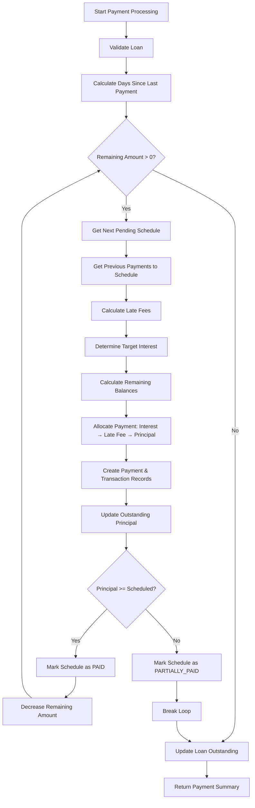

# ProcessPayment Function Analysis

## Overview
The `processPayment` function in [`payments.service.ts`](file:///c:/Users/Administrator/admin-loans-system/backend/src/payments/payments.service.ts#L30-L280) processes loan payments, allocating funds across multiple installments, calculating interest and late fees, and updating all relevant records within a database transaction.

---

## Step-by-Step Breakdown

### Step 1: Initialize Transaction (Lines 31-34)
```typescript
return this.prisma.$transaction(async (tx) => {
  const paidAt = new Date(dto.paymentDate);
  const payments: any[] = [];
  const transactions: any[] = [];
```
**Purpose:**
- Wraps everything in a **database transaction** for atomicity (all-or-nothing)
- Converts payment date to Date object
- Initializes tracking arrays for created payment and transaction records

---

### Step 2: Fetch & Validate Loan (Lines 36-57)
```typescript
const loan = await tx.loan.findUnique({
  where: { id: dto.loanId },
  include: { disbursement: true },
});
```
**Validations Performed:**
- ✅ Loan exists
- ✅ Loan status is `ACTIVE`
- ✅ Loan has a disbursement record
- ✅ Outstanding principal > 0 (not already fully repaid)

**Throws BadRequestException if any validation fails**

---

### Step 3: Calculate Days Since Last Payment (Lines 59-73)
```typescript
const lastPayment = await tx.payment.findFirst({
  where: { loanId: dto.loanId },
  orderBy: { paymentDate: 'desc' },
});

const lastDate = lastPayment
  ? new Date(lastPayment.paymentDate)
  : new Date(loan.disbursement.disbursementDate);

const daysSinceLastPayment = Math.floor(diffMs / (1000 * 60 * 60 * 24));
```
**Purpose:**
- Gets the most recent payment (or disbursement date if first payment)
- Calculates days elapsed for **daily interest accrual**
- Validates payment date is not before last payment

---

### Step 4: Process Payment Across Multiple Schedules (Lines 75-254)
```typescript
let remainingAmount = dto.amount;
let totalPrincipalPaid = 0;
let currentOutstanding = outstandingPrincipal;

while (remainingAmount > 0) {
  const nextSchedule = await tx.repaymentSchedule.findFirst({
    where: {
      loanId: dto.loanId,
      status: { in: ['PENDING', 'PARTIALLY_PAID'] }
    },
    orderBy: { installmentNumber: 'asc' },
  });
```

**Key Concept:** A single payment can cover **multiple installments**

**Loop continues until:**
- All payment amount is allocated, OR
- No more pending/partially paid schedules exist

---

### Step 5: Get Previous Payments to Current Installment (Lines 97-117)
```typescript
const previousPayments = await tx.payment.findMany({
  where: {
    repaymentScheduleId: nextSchedule.id,
    status: 'COMPLETED',
  },
});

const totalInterestAlreadyPaid = previousPayments.reduce(
  (sum, p) => sum + Number(p.interestPaid), 0
);
const totalLateFeesAlreadyPaid = previousPayments.reduce(
  (sum, p) => sum + Number(p.lateFeePaid), 0
);
const totalPrincipalAlreadyPaid = previousPayments.reduce(
  (sum, p) => sum + Number(p.principalPaid), 0
);
```

**Purpose:** Handle **partial payments** by checking what's already been paid toward this specific installment

**Tracks:**
- Total interest already paid to this installment
- Total late fees already paid to this installment
- Total principal already paid to this installment

---

### Step 6: Calculate Late Fees (Lines 119-125)
```typescript
let daysLate = 0;
const dueDate = new Date(nextSchedule.dueDate);
const diffLateMs = paidAt.getTime() - dueDate.getTime();
daysLate = Math.max(0, Math.floor(diffLateMs / (1000 * 60 * 60 * 24)));

const lateFee = LateFeeCalculator.calculateLateFee(daysLate);
```

**Purpose:**
- Calculates how many days **past the due date** the payment is
- Uses `LateFeeCalculator` utility to determine late fee amount
- `daysLate` is always >= 0 (early payments have 0 days late)

---

### Step 7: Determine Target Interest (Lines 127-156)
```typescript
let targetInterest: number;

if (previousPayments.length === 0) {
  // FIRST payment to this installment - calculate accrued interest now
  targetInterest = InterestCalculator.calculateAccruedInterest(
    currentOutstanding,
    Number(loan.interestRate),
    daysSinceLastPayment,
  );
} else {
  // SUBSEQUENT payment to same installment
  // Target interest = what was charged in the FIRST payment to this installment
  const firstPayment = previousPayments[0];
  targetInterest = Number(firstPayment.interestPaid);
  
  // Handle edge case: first payment was too small to cover all interest
  if (Number(firstPayment.principalPaid) === 0 && Number(firstPayment.lateFeePaid) === 0) {
    targetInterest = totalInterestAlreadyPaid;
  }
}
```

**Critical Logic:**
- **First payment to installment:** Calculate accrued interest based on days elapsed and current outstanding principal
- **Subsequent payments (partial):** Use the interest amount from the **first payment** to maintain consistency across multiple partial payments to the same installment

> [!IMPORTANT]
> This ensures that if someone makes multiple partial payments to the same installment, the total interest charged remains consistent with the first calculation.

---

### Step 8: Calculate Remaining Balances (Lines 158-170)
```typescript
const scheduledPrincipal = Number(nextSchedule.principalAmount);

const remainingInterest = Math.max(0, targetInterest - totalInterestAlreadyPaid);
const remainingLateFee = Math.max(0, lateFee - totalLateFeesAlreadyPaid);
const remainingPrincipal = Math.max(0, scheduledPrincipal - totalPrincipalAlreadyPaid);

const totalRemainingForInstallment = 
  remainingInterest + remainingLateFee + remainingPrincipal;

const amountForThisSchedule = Math.min(
  remainingAmount, 
  totalRemainingForInstallment
);
```

**Purpose:**
- Calculates what's still **owed** on this specific installment
- Determines how much of the payment to allocate to **this schedule**
- Ensures we don't allocate more than what's remaining to pay

---

### Step 9: Allocate Payment with Priority (Lines 172-177)
```typescript
const allocation = AllocationEngine.allocate(
  amountForThisSchedule,
  remainingInterest,
  remainingLateFee,
);
```

**Allocation Priority (Waterfall):**
1. 🔴 **Interest** (highest priority)
2. 🟡 **Late fees**
3. 🟢 **Principal** (remainder)

**The AllocationEngine ensures funds are distributed in this specific order.**

---

### Step 10: Create Payment & Transaction Records (Lines 179-210)
```typescript
const payment = await tx.payment.create({
  data: {
    loanId: loan.id,
    repaymentScheduleId: nextSchedule.id,
    amount: amountForThisSchedule,
    paymentDate: paidAt,
    principalPaid: allocation.principalPaid,
    interestPaid: allocation.interestPaid,
    lateFeePaid: allocation.lateFeePaid,
    daysLate,
    status: 'COMPLETED',
  },
});

const transaction = await tx.transaction.create({
  data: {
    type: 'REPAYMENT',
    refId: payment.id,
    amount: amountForThisSchedule,
  },
});

await tx.payment.update({
  where: { id: payment.id },
  data: { transactionId: transaction.id },
});
```

**Creates:**
- **Payment record** linked to the repayment schedule with allocation breakdown
- **Transaction record** for audit trail
- Links payment to transaction (bidirectional reference)
- Adds to tracking arrays for return value

---

### Step 11: Update Outstanding Principal (Lines 211-215)
```typescript
totalPrincipalPaid += allocation.principalPaid;

currentOutstanding -= allocation.principalPaid;
if (currentOutstanding < 0) currentOutstanding = 0;
```

**Purpose:**
- Tracks total principal paid across **all installments** in this single payment
- Updates the **running balance** for accurate interest calculations on subsequent schedules within the same payment
- Prevents negative outstanding balance

---

### Step 12: Update Schedule Status (Lines 217-249)
```typescript
if (allocation.principalPaid >= scheduledPrincipal) {
  // Payment covered the scheduled principal for this installment
  await tx.repaymentSchedule.update({
    where: { id: nextSchedule.id },
    data: {
      status: 'PAID',
      paidDate: paidAt,
    },
  });
  // Continue loop to next schedule
} else if (allocation.principalPaid > 0) {
  // Some principal paid, but not enough to cover scheduled amount
  await tx.repaymentSchedule.update({
    where: { id: nextSchedule.id },
    data: { status: 'PARTIALLY_PAID' },
  });
  break; // Stop processing
} else if (allocation.interestPaid > 0 || allocation.lateFeePaid > 0) {
  // Only covered interest/fees, no principal yet
  await tx.repaymentSchedule.update({
    where: { id: nextSchedule.id },
    data: { status: 'PARTIALLY_PAID' },
  });
  break; // Stop processing
}
```

**Status Logic:**
- **PAID:** Full scheduled principal covered → **continue** to next installment
- **PARTIALLY_PAID:** Some principal paid but not full amount → **stop** (stay on this schedule for next payment)
- **PARTIALLY_PAID:** Only interest/fees covered, no principal → **stop**

**The loop continues only if installment is fully paid, otherwise breaks**

---

### Step 13: Decrease Remaining Amount (Line 252)
```typescript
remainingAmount -= amountForThisSchedule;
```

**Purpose:**
- Reduces the payment amount available for subsequent installments
- Loop continues if `remainingAmount > 0` and schedule was marked PAID

---

### Step 14: Update Loan Record (Lines 256-267)
```typescript
const newOutstanding = Number(
  Math.max(0, outstandingPrincipal - totalPrincipalPaid).toFixed(2),
);

await tx.loan.update({
  where: { id: loan.id },
  data: {
    outstandingPrincipal: newOutstanding,
    status: newOutstanding === 0 ? 'CLOSED' : loan.status,
  },
});
```

**Updates:**
- Loan's outstanding principal balance
- Loan status to `CLOSED` if fully repaid

---

### Step 15: Return Result (Lines 269-278)
```typescript
return {
  message: 'Payment processed successfully',
  payments,              // Array of payment records created
  transactions,          // Array of transaction records created
  totalAmount: dto.amount,
  totalPrincipalPaid,
  schedulesCovered: payments.length,
  newOutstandingPrincipal: newOutstanding,
  daysSinceLastPayment,
};
```

---

## 🔧 Identified Issues & Improvements

### 🔴 Critical Issue #1: Interest Calculation for Multiple Installments
**Location:** Lines 135-139

**Problem:** When a payment covers multiple installments in one go, `daysSinceLastPayment` is calculated once at the beginning (line 70) and reused for all installments. However:
- The first installment uses the correct days elapsed
- The second installment should calculate interest from the first installment's due date, but it still uses the original `daysSinceLastPayment`

**Impact:** Interest is **overcalculated** for subsequent installments when multiple are paid at once.

**Fix:**
```typescript
// Calculate interest period for EACH installment independently
const previousDueDate = lastPayment 
  ? new Date(lastPayment.repaymentScheduleId.dueDate) 
  : new Date(loan.disbursement.disbursementDate);
  
const currentDueDate = new Date(nextSchedule.dueDate);
const daysForThisInstallment = Math.floor(
  (paidAt.getTime() - previousDueDate.getTime()) / (1000 * 60 * 60 * 24)
);
```

---

### 🟡 Issue #2: Schedule Status Comparison Logic
**Location:** Line 219

**Problem:** Compares `allocation.principalPaid >= scheduledPrincipal` but doesn't account for **previously paid principal** in partial payment scenarios.

**Current Code:**
```typescript
if (allocation.principalPaid >= scheduledPrincipal) {
  // Mark as PAID
}
```

**Should be:**
```typescript
const totalPrincipalPaidToSchedule = totalPrincipalAlreadyPaid + allocation.principalPaid;
if (totalPrincipalPaidToSchedule >= scheduledPrincipal) {
  // Mark as PAID
}
```

---

### 🟡 Issue #3: Database Queries in Loop
**Location:** Lines 82, 98

**Problem:** Multiple database queries executed inside the while loop can cause performance issues with many installments.

**Impact:** N+1 query problem - could be slow for loans with many installments.

**Optimization:**
```typescript
// Before the loop, fetch all schedules and payments at once
const allSchedules = await tx.repaymentSchedule.findMany({
  where: { loanId: dto.loanId, status: { in: ['PENDING', 'PARTIALLY_PAID'] } },
  orderBy: { installmentNumber: 'asc' },
});

const allPayments = await tx.payment.findMany({
  where: { loanId: dto.loanId, status: 'COMPLETED' },
});

// Then iterate through in-memory arrays instead of querying in loop
```

---

### 🟡 Issue #4: Partial Payment Interest Logic Complexity
**Location:** Lines 140-156

**Problem:** The logic to preserve target interest from first partial payment is complex and has edge cases (lines 152-155).

**Simpler Approach:** Calculate interest fresh for each installment period, store calculated interest on the repayment schedule record itself when first payment is made.

---

### 🟢 Issue #5: Missing Validations

**Missing Checks:**
- ❌ Negative payment amounts
- ❌ Excessive overpayment limits
- ❌ Currency mismatch between payment and loan
- ❌ Idempotency (duplicate payment prevention)
- ❌ Payment date in the future

**Suggested Additions:**
```typescript
// At the beginning of processPayment
if (dto.amount <= 0) {
  throw new BadRequestException('Payment amount must be positive');
}

if (dto.amount > outstandingPrincipal * 2) {
  throw new BadRequestException('Payment amount exceeds reasonable overpayment limit');
}

// Check for duplicate payments (idempotency)
const existingPayment = await tx.payment.findFirst({
  where: {
    loanId: dto.loanId,
    amount: dto.amount,
    paymentDate: paidAt,
    status: 'COMPLETED',
  },
});

if (existingPayment) {
  throw new BadRequestException('Duplicate payment detected');
}
```

---

### 🟢 Issue #6: Error Handling & Logging

**Missing:**
- No transaction rollback logging
- No calculation step logging for debugging
- No performance timing
- No audit trail for failed payments

**Suggested Improvements:**
```typescript
const startTime = Date.now();
this.logger.log(`Starting payment processing for loan ${dto.loanId}`, {
  amount: dto.amount,
  paymentDate: dto.paymentDate,
});

try {
  // ... existing logic
  
  this.logger.log(`Payment processed successfully in ${Date.now() - startTime}ms`, {
    loanId: dto.loanId,
    schedulesCovered: payments.length,
    totalPrincipalPaid,
  });
} catch (error) {
  this.logger.error(`Payment processing failed for loan ${dto.loanId}`, {
    error: error.message,
    stack: error.stack,
  });
  throw error;
}
```

---

### 🟢 Issue #7: Type Safety

**Location:** Lines 33-34
```typescript
const payments: any[] = [];
const transactions: any[] = [];
```

**Issue:** Using `any[]` defeats TypeScript's type checking

**Fix:**
```typescript
const payments: Payment[] = [];
const transactions: Transaction[] = [];
```

---

## 📊 Flow Diagram



---

## 🎯 Recommended Priority for Fixes

1. **High Priority:**
   - Fix interest calculation for multiple installments (#1)
   - Fix schedule status comparison logic (#2)
   - Add idempotency check (#5)

2. **Medium Priority:**
   - Optimize database queries (#3)
   - Add comprehensive logging (#6)
   - Add input validations (#5)

3. **Low Priority:**
   - Simplify partial payment logic (#4)
   - Improve type safety (#7)

---

## 📝 Summary

The `processPayment` function implements a sophisticated payment allocation system that:
- ✅ Handles partial payments
- ✅ Supports multiple installments in one payment
- ✅ Calculates daily interest accrual
- ✅ Applies late fees
- ✅ Maintains audit trail
- ✅ Uses database transactions for atomicity

However, it has several areas for improvement related to interest calculation accuracy, performance optimization, and validation completeness.
